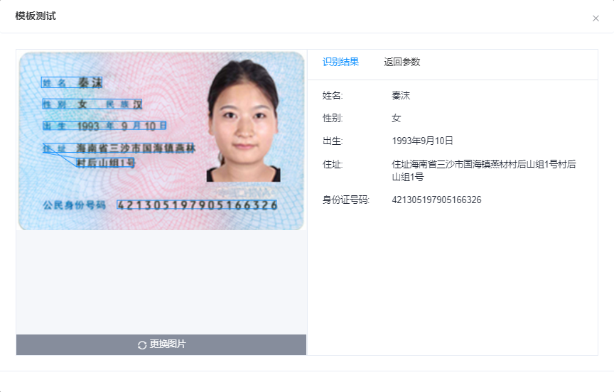
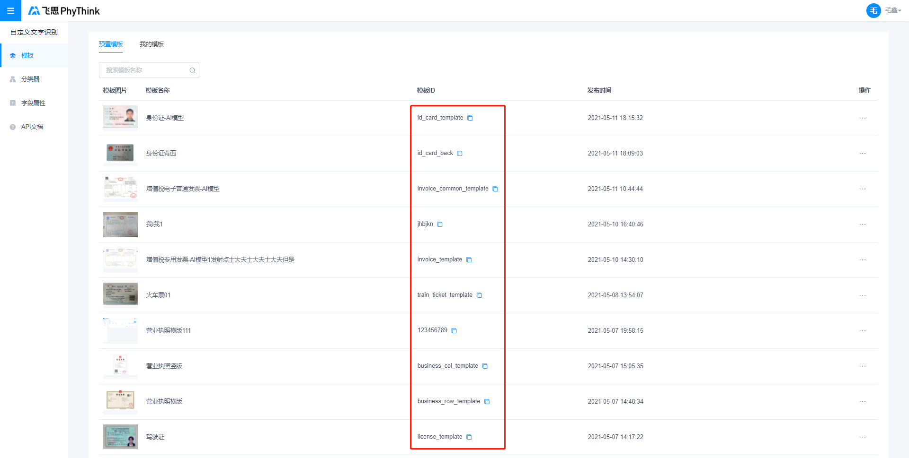
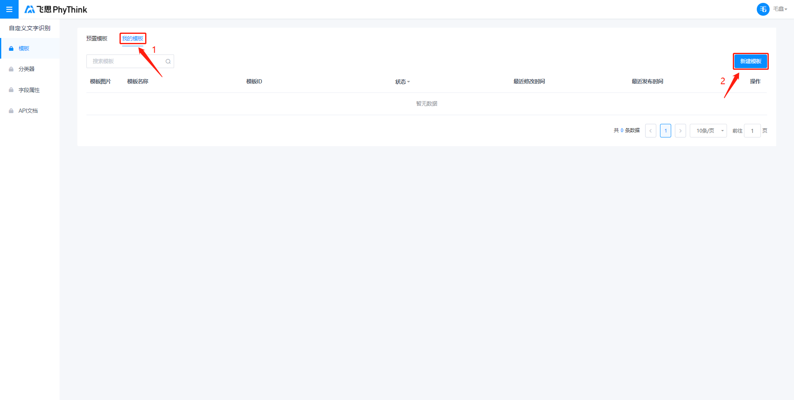
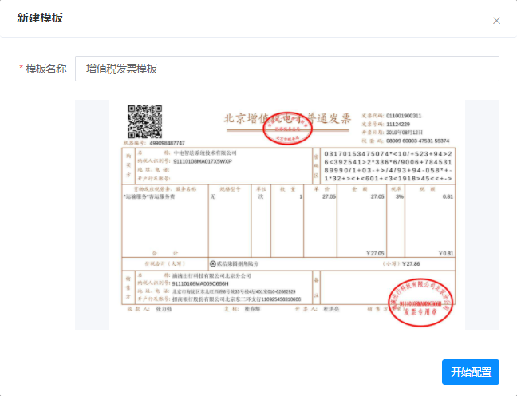
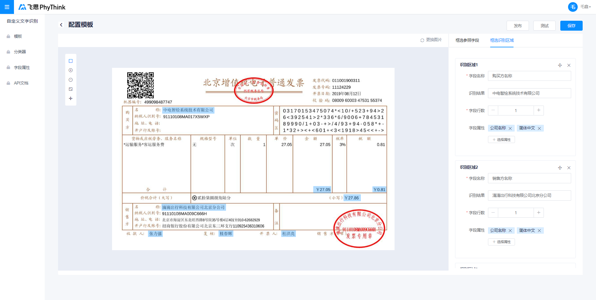
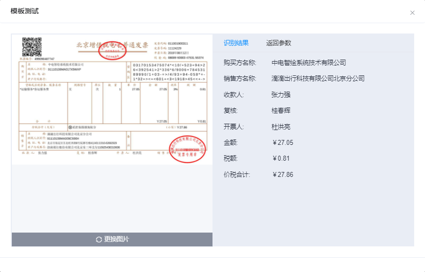
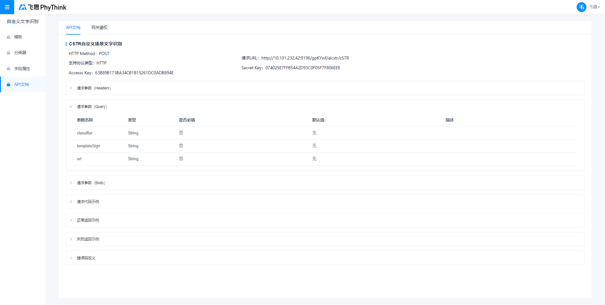

# 模板

> 更新时间： 2021/05/16 GMT+8:00

## 使用预置模板

平台为用户提供了**「身份证」**、**「增值税发票」**、**「驾驶证」**、**「火车票」**、**「营业执照」**5种业务常用的预置模板。如下图，用户可在[预置模板页](http://10.101.232.44/aicstr/#/mould)选择需要的模板进行在线测试，并点击图片下方「更换图片」按钮更换测试图片。

如多次测试效果满意即可进行发布，则可直接使用[预置模板页](http://10.101.232.44/aicstr/#/mould)内的模板ID调用线上环境的API。调用方式可查看[API文档页](http://10.101.232.44/aicstr/#/apiDocument)。

## 5分钟制作自定义模板

创建自定义模板的基本流程分为以下5步，用户仅需上传一张规范的模板图片，通过简单框选，5分钟即可完成模板制作，进而对相同板式的图片进行结构化识别。

- [Step 1：上传模板图片](#1)
- [Step 2：框选参照字段](#2)
- [Step 3：框选识别区域](#3)
- [Step 4：测试模板](#4)
- [Step 5：发布模板、调用API](#5)

### <text id="1">Step 1: 上传模板图片</text>

进入飞思cSTR平台的[模板管理页](http://10.101.232.44/aicstr/#/mould)，进入**「我的模板TAB」**，点击**「创建模板」**按钮

在弹出框中上传一张**字迹清晰且摆放端正**的模板图片（大小不超过4M，最长边不超过4096像素），并对模板进行命名。

### <text id="2">Step 2: 框选参照字段</text>

进入模板配置页后，系统会默认选中**「矩形框选工具」**、**「框选参照字段TAB」**，用户可直接在模板图片中框选参照字段，如下图发票中的：机器编号、收款人、发票号码、开票日期、开票人。

> **注意：**「参照字段」为模板图片和后期识别图片中共同拥有，且文字内容和位置固定不变的字段。可框选做为图片的锚点，用做对后续传入的图片进行自动矫正和模板匹配

> **框选Tips:**
>
> 
 

>1. 框选4个以上参照字段，并尽量分散在四角，字段越多识别越准确
>
> 2. 保证框选字段的文字内容、位置都保持固定不变
>
> 3. 单个参照字段不允许跨行
>
> 4. 不同参照字段名称不允许重复
>
> 5. 参照字段支持中文、英文、数字，不可含有符号和图案

### <text id="3">Step 3: 框选识别区域</text>

当完成参照字段的框选后，点击右侧**「框选识别区域TAB」**，对实际业务场景需要识别的区域进行框选，如下图所示，业务要求对购买方名称、销售方名称、金额、税额、价税合计、收款人、复核、开票人字段进行识别。

同时，框选完成后，需要在右侧填写适当的**「字段名称」**，并选择合适的**「字段属性」**和**「字段行数」**以提高识别准确率。

> **注意：**「识别区」图片中需要进行识别的字段，可通过框选及命名构建 「字段名称 : 识别区内容」 的 Key : Value 对应关系，用于对后续传入的识别图片的相同位置区域进行结构化文字识别

> **框选Tips：**
>
> 
 

>1. 完全覆盖文字可能出现的范围，保证后续传入图片的对应字段内容可被完全覆盖，但同时也需保证不框选到其他字段内容
>2. 选择合适的字段属性有助于提升字段识别效果，若系统内置的字段属性不足以定义您需要识别的内容，可选择新建自定义字段属性

### <text id="4">Step 4: 测试模板</text>

参照字段和识别区域全部框选完毕后，可点击页面右上角的**「测试」**按钮进行识别效果测试，在弹出框中上传任意一张相同版式的图片即可，如下图所示。可点击图片下方「更换图片」按钮更换测试图片，如多次测试效果满意即可进行发布；如效果不满意可返回继续编辑。

> **注意：**
>
> 1. 如测试结果出现图片无法匹配模板的情况，将返回图片中所有识别到的文字``raw_data``。此时，用户需确认上传的测试图片与模板图片是否为同一版式，如确认无误可考虑更换参照字段，以提升模板匹配准确率
> 2. 如试一试结果中出现识别结果错误的情况，可调整识别区框选范围或更换识别区字段属性，以提升识别准确率

### <text id="5">Step 5: 发布模板、调用API</text>

如测试效果满意，可点击试一试弹出框右上角的**「发布」**按钮或模板编辑页面的**「发布」**按钮进行发布，发布成功后即可通过模板ID调用该模板，调用方式可查看[API文档页](http://10.101.232.44/aicstr/#/apiDocument)。

> **注意：**只有发布后的模板才能通过线上接口进行调用，如果编辑未发布，那么仅仅是生成了一个新的版本，此时对模板的任何修改都不会影响线上调用。

