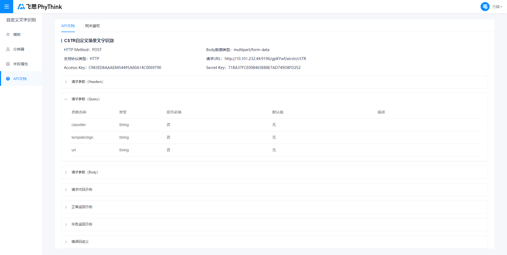

# 分类器

> 更新时间： 2021/05/16 GMT+8:00

## 自定义分类器

创建自定义分类器的基本流程分为以下4步，用户仅需选择需要分类的模板，并编辑模板的分类关键词，即可完成分类器的配置，进而对图片进行自动模板匹配和结构化识别。

- [Step 1：选择模板](#Step 1: 选择模板)
- [Step 2： 编辑分类关键词](#Step 2: 编辑分类关键词)
- [Step 3：测试分类器](#Step 3: 测试分类器)
- [Step 4：测试分类器、调用API](#Step 4: 发布分类器)

### Step 1: 选择模板

在[分类器管理页](http://10.101.232.44/aicstr/#/classifier)点击**「新建分类器」**按钮，在弹窗中填写**「分类器名称」**、**「分类器描述」**，并选择需要进行分类的模板，即可完成分类器的创建。

> **注意**：只有用户**已发布**的模板和预置模板可以被分类器添加，若模板未发布则不会显示在新建分类器弹窗中。

### Step 2: 编辑分类关键词

分类器创建成功后，进入**「分类器详情」**页，在模板列表中的**「分类关键词」**列编辑对应模板的分类关键词，需保证填写的关键词在该版式图片中均有出现，且具代表性，分类器会根据填写的关键词命中率选择模板类别。

平台默认会使用各个模板的**「参照字段」**作为模板的分类关键词，为了确保分类结果的准确，用户可选择手动填写更具有代表性的分类关键词。

>**注意**：
当前版本``2021/05/16``，分类器使用图片中的**文字特征**进行分类：
针对用户填写的分类器中各模板的分类关键词，对图片进行全版面文字识别，分类器会选中分类关键词命中率最高的模板。请确保所有模板的分类关键词在模板中存在，且代表性较强(与其他模板重复率较低)。

> 名词解释：
>
> | 名词                                          | 解释说明                                                     |
> | --------------------------------------------- | ------------------------------------------------------------ |
> | **
分类关键词
** | 图片中存在的代表性较强的文字内容，用作模板分类的文字依据，需保证填写的关键词在该版式图片中均有出现，分类器会根据填写的关键词命中率选择模板类别。*如身份证人像面的“姓名”、“性别”、“民族”、“出生”、“公民身份号码”五个字段在每一张身份证人像面均会出现，且 5 个字段全部出现时基本可确定该图片为身份证人像面，则此 5 个字段即可作为身份证人像面的分类关键词* |

### Step 3: 测试分类器

分类器配置完成后回到[分类器管理页](http://10.101.232.44/aicstr/#/classifier1)，点击分类器卡片右下角的**「测试」**按钮进行效果测试。在弹窗中上传任意模板板式的图片，如下图所示，测试结果中会包含分类结果和结构化识别结果。可点击图片下方「更换图片」按钮更换测试图片，如多次测试效果满意即可进行发布；如效果不满意可返回继续编辑。

### Step 4: 发布分类器

如测试效果满意，可点击分类器卡片右下角的 **「发布」** 按钮对分类器进行发布，发布成功后即可通过分类器ID调用该分类器，实现图片的自动分类及结构化识别，调用方式可查看[API文档页](http://10.101.232.44/aicstr/#/apiDocument)。

> **注意：**只有发布后的分类器才能通过线上接口进行调用，如果编辑未发布，那么仅仅是生成了一个新的版本，此时对分类器的任何修改都不会影响线上调用。

