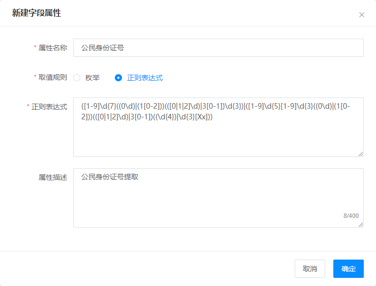

# 字段属性

> 更新时间： 2021/05/16 GMT+8:00

## 使用预置字段属性

平台为用户提供了**「数字」**、**「中文」**、**「英文」**等**「基础字符串规则」**，以及**「姓名」**、**「性别」**、**「日期」**、**「发票号码」**、**「数字金额」**等**「业务属性」**。如下图，用户在配置自定义模板时，可对识别区域的字段属性进行定义，系统会根据识别字段的属性对识别结果进行智能纠正，用于规范识别结果，提高准确率。

## 自定义字段属性

平台支持以下2种方式创建自定义字段属性：

- [枚举](#枚举)
- [正则表达式](#正则表达式)

> **枚举**：列举出识别区域全部可能出现的值。*如对身份证人像面的"性别"字段进行定义时，列举出”男“和”女“两个值，即可覆盖该字段全部可能出现的值*
>
> **正则表达式**：对识别区域所有可能出现值的字符串规则进行定义。*如对身份证人像面的‘"公民身份证号码"字段进行定义时，输入正则表达式“([1-9]\d{7}((0\d)|(1[0-2]))(([0|1|2]\d)|3[0-1])\d{3})|([1-9]\d{5}[1-9]\d{3}((0\d)|(1[0-2]))(([0|1|2]\d)|3[0-1])((\d{4})|\d{3}[Xx]))”，即可对识别区域的结果进行纠正。*

进入[字段属性管理页](http://10.101.232.44/aicstr/#/fieldProperties)，点击**「我的属性TAB」**，点击**「新建字段属性」**按钮，在弹窗内填写**「属性名称」**和**「属性描述」**以及定义字段属性的**「取值规则」**。

同时，用户可在配置模板时点击**「+选择属性」**按钮，在弹窗内继续点击**「+添加自定义属性」**按钮及时配置自定义字段属性。

同时用户

### 枚举

如下图，使用枚举类型定义”民族“字段所有可能出现的识别结果，不同值之间使用换行符(\n)分隔，系统会自动过滤空行。

### 正则表达式

如下图，使用正则表达式对“公民身份证号”的字段值进行定义和结果纠正。

创建成功的字段属性可在自定义模板配置识别区域字段属性时，点击**「+选择属性」**按钮进行勾选使用，使用后即可对该识别区域的文字内容进行纠正。

